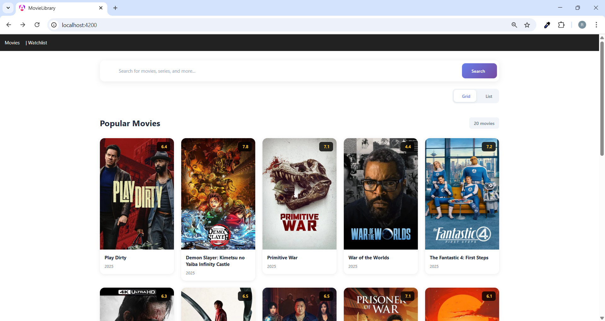
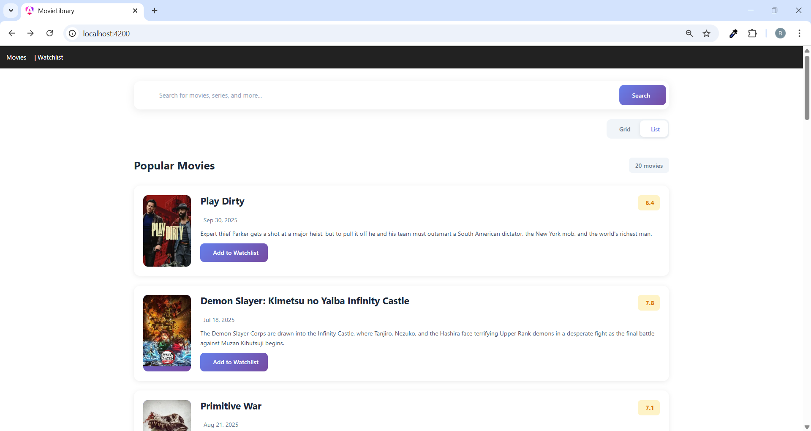
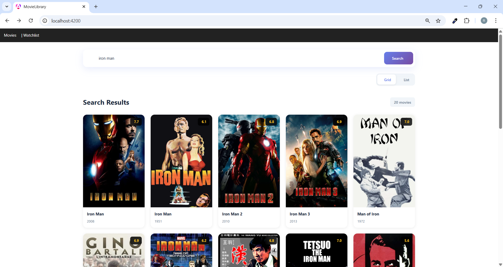
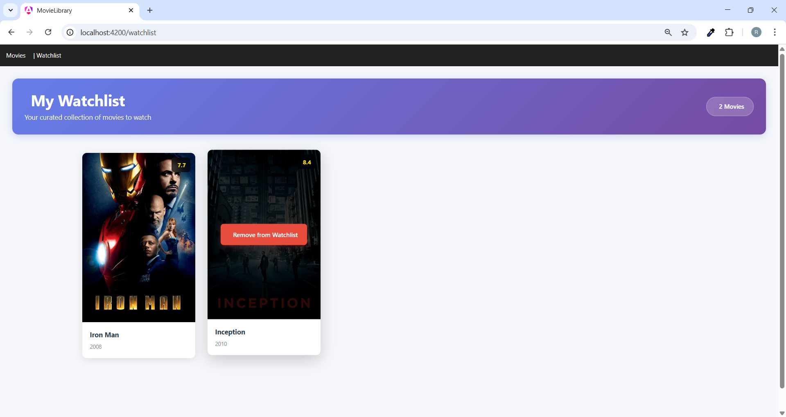

# MovieLibrary

This project was generated using [Angular CLI](https://github.com/angular/angular-cli) version 19.2.15.


2. **TMDB API Key and Token**  
   - Go to [TMDB API Settings](https://www.themoviedb.org/settings/api) to generate your **API Key** and **TMDB Token**.
   - Open the file `src\app\environments\environment.ts` and add your credentials:

   ```typescript
  /* export const environment = {
     tmdbApiKey: 'Add_api_key_here',
     tmdbBaseUrl: 'https://api.themoviedb.org/3',
     tmdbToken: 'Add_Tmdb_Token_here'
   };*/
   
## Development server

To start a local development server, run:

```bash
ng serve
```

Once the server is running, open your browser and navigate to `http://localhost:4200/`. The application will automatically reload whenever you modify any of the source files.


## Code scaffolding

Angular CLI includes powerful code scaffolding tools. To generate a new component, run:

```bash
ng generate component component-name
```

For a complete list of available schematics (such as `components`, `directives`, or `pipes`), run:

```bash
ng generate --help
```

## Building

To build the project run:

```bash
ng build
```

This will compile your project and store the build artifacts in the `dist/` directory. By default, the production build optimizes your application for performance and speed.


## Project Evidence

Here are some key screenshots demonstrating the main functionality of the Movie Library project.

### 1. Movies Homepage
The homepage displays featured movies and navigation options.


---

### 2. Home Page Movies List
A list/grid view of available movies for browsing.


---

### 3. Search Result
Shows how the search functionality returns relevant movies.


---

### 4. Watch List
Demonstrates how users can add movies to their personal watchlist.


